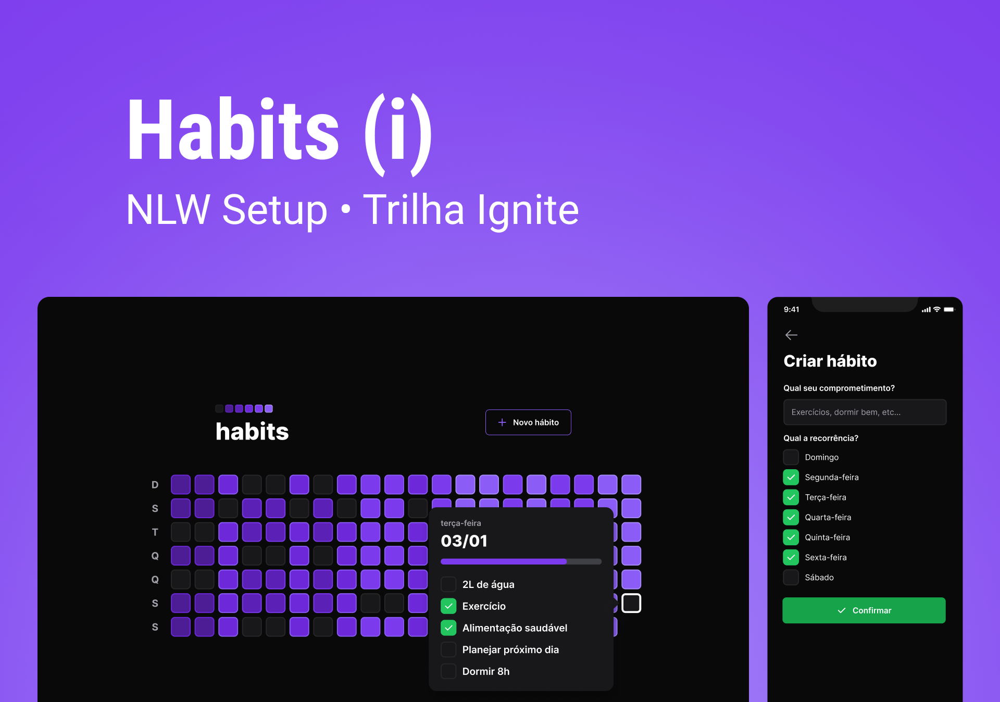

<h1 align="center">Habits Web</h1>

<p align="center">
  <a href="#-tecnologias">Tecnologias</a>&nbsp;&nbsp;&nbsp;|&nbsp;&nbsp;&nbsp;
  <a href="#-projeto">Projeto</a>&nbsp;&nbsp;&nbsp;|&nbsp;&nbsp;&nbsp;
  <a href="#-layout">Layout</a>&nbsp;&nbsp;&nbsp;|&nbsp;&nbsp;&nbsp;
    <a href="#-clonando-o-projeto-para-sua-máquina">Clonar</a>&nbsp;&nbsp;&nbsp;
</p>

<br>

<p align="center">
  
</p>

## 🚀 Tecnologias

Esse projeto foi desenvolvido com as seguintes tecnologias:

- [React Native](https://pt-br.reactjs.org/)
- [TypeScript](https://www.typescriptlang.org/)
- [Node e NPM](https://nodejs.org/)
- [Tailwindcss](https://tailwindcss.com/docs/installation)
- [Axios](https://axios-http.com/ptbr/docs/intro)
- [DayJs](https://day.js.org/)
- [Radix](https://www.radix-ui.com/)

## 🔖 Layout

Você pode visualizar o layout do projeto através [DESSE LINK](https://www.figma.com/file/GlHkdDElpnz7EBoTtbyBeM/Habits-(i)-(Community)-(Copy)?node-id=6%3A343&t=P2CI9evake0r2jgs-0). É necessário ter conta no [Figma](https://figma.com) para acessá-lo.

#

Você pode acessar a API usada no projeto aqui [**projeto no github** aqui](https://github.com/marlisonmourao/server-habits).

#


# 💻 Clonando o projeto para sua máquina

1. Abra o terminal de seu computador.
2. Acessar a pasta de seus projetos.
3. Estando dentro da pasta de seus projetos, execute os comandos abaixo para clonar o projeto online:

```bash
# Para fazer o download do projeto para seu computador
$ git clone git@github.com:marlisonmourao/habits-web.git

# Entrar na pasta do projeto 
$ cd habits-web

# Para baixar as dependências do projeto
$ npm install ou npm i

# Abra com o editor vscode
$ code .
```

4. Pronto, agora basta testar e fazer as alterações que desejar.
  
<br>
<br>

<p align="center"></p>
<br>
<br>

---
<p align="center"> Made with 💜 by <a href="https://github.com/marlisonmourao"> Marlison Mourão </a></p>